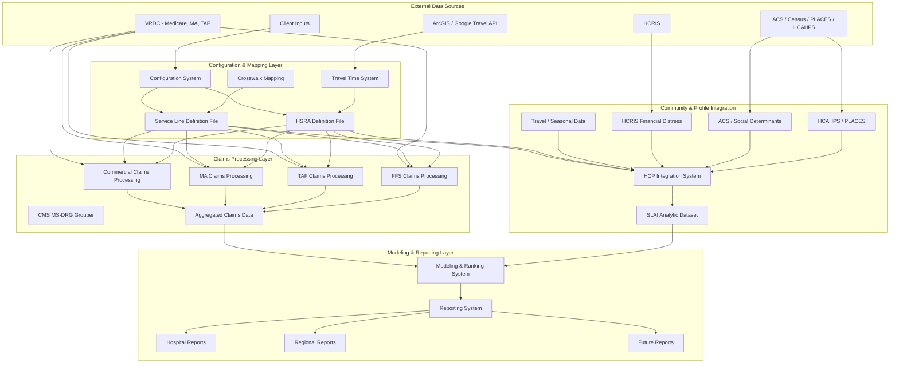

```mermaid
flowchart TB

%% External Sources
subgraph ExternalSources[External Data Sources]
    A1[Client Inputs]
    A2[VRDC - Medicare, MA, TAF]
    A3[ArcGIS / Google Travel API]
    A4[HCRIS]
    A5[ACS / Census / PLACES / HCAHPS]
end

%% Configuration & Mapping Layer
subgraph Config[Configuration & Mapping Layer]
    B1[Configuration System]
    B2[Crosswalk Mapping]
    B3[Travel Time System]
    B4[Service Line Definition File]
    B5[HSRA Definition File]
end

%% Claims Processing Layer
subgraph Processing[Claims Processing Layer]
    C1[Commercial Claims Processing]
    C2[MA Claims Processing]
    C3[TAF Claims Processing]
    C4[FFS Claims Processing]
    C5[CMS MS-DRG Grouper]
    C6[Aggregated Claims Data]
end

%% Community & Profile Integration
subgraph Integration[Community & Profile Integration]
    D1[HCP Integration System]
    D2[Travel / Seasonal Data]
    D3[HCRIS Financial Distress]
    D4[ACS / Social Determinants]
    D5[HCAHPS / PLACES]
    D6[SLAI Analytic Dataset]
end

%% Modeling & Reporting Layer
subgraph Modeling[Modeling & Reporting Layer]
    E1[Modeling & Ranking System]
    E2[Reporting System]
    E3[Hospital Reports]
    E4[Regional Reports]
    E5[Future Reports]
end

%% Flows
A1 --> B1
A2 --> C1 & C2 & C3 & C4
A3 --> B3
A4 --> D3
A5 --> D4 & D5

B1 --> B4 & B5
B2 --> B4
B3 --> B5
B4 & B5 --> C1 & C2 & C3 & C4

C1 & C2 & C3 & C4 --> C6
C6 --> E1

B4 & B5 --> D1
D2 & D3 & D4 & D5 --> D1
D1 --> D6 --> E1

E1 --> E2 --> E3 & E4 & E5

```
